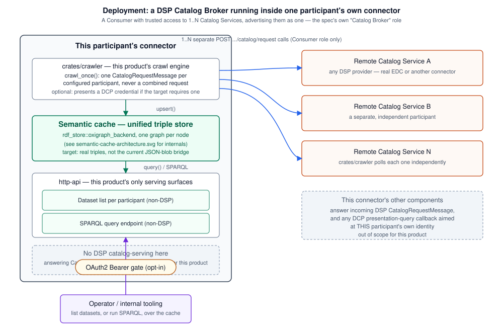

# Semantic Catalog Broker

*(repo name: `ds-catalog-broker-rs`; product binary/crate: `ds-catalog-broker-rs`, `crates/http-api` before this project's rebrand)*

An iterative, from-scratch Rust rewrite of [Eclipse EDC](https://projects.eclipse.org/projects/technology.edc)'s
**Federated Catalog** module, built around what the [Dataspace Protocol (DSP) specification](https://raw.githubusercontent.com/eclipse-dataspace-protocol-base/DataspaceProtocol/main/catalog/catalog.protocol.md)
itself calls a **Catalog Broker**:

> "A Dataspace MAY include Catalog Brokers. A Catalog Broker is a
> Consumer that has trusted access to 1..N upstream Catalog Services
> and advertises their respective Catalogs as a single Catalog Service.
> The Catalog Broker SHOULD honor upstream access control requirements
> (Policies)."
> — [`catalog.protocol.md`, "Catalog Brokers"](https://raw.githubusercontent.com/eclipse-dataspace-protocol-base/DataspaceProtocol/main/catalog/catalog.protocol.md)

Concretely: this product periodically **harvests** (crawls) DSP catalogs
from 1..N configured participants as a DSP **Consumer**, maintains the
result in a unified **semantic cache** (an RDF/Oxigraph-backed triple
store — see ["The RDF backend"](#the-rdf-backend-semantic-cache) below),
and serves that cache locally as (a) a dataset list per participant and
(b) a SPARQL endpoint for searching across everything harvested. See
["Role: a DSP Catalog Broker"](#role-a-dsp-catalog-broker) below for what
that does and does not include.

## What this is (and isn't)

This is a rewrite, not a port. The goal is a Federated Catalog that
behaves like EDC's — a crawler periodically pulls catalogs from known
dataspace participants and makes the aggregate queryable — designed from
scratch in Rust, taking the *shape* of the problem from EDC's Java
implementation without transliterating its classes, package layout, or
internal abstractions.

**It is not a general-purpose DSP connector.** It does not, and should
not, answer incoming DSP `CatalogRequestMessage`s, negotiate contracts,
or transfer data. Those are the job of a dataspace participant's *other*
connector components — the ones this product addresses when it crawls
them. Conflating the two was an early mistake in this project (this
product's own `ds-catalog-broker-rs` crate (then named `http-api`) used to
expose a `POST /dsp/catalog/request`
provider endpoint) — see
[`docs/gap-analysis-2026-08-27.md`](docs/gap-analysis-2026-08-27.md) for
the corrective work that follows from fixing it.

The rewrite proceeds crate by crate, iteration by iteration: each crate
starts as a minimal skeleton that compiles and passes its own tests, and
gets built out once the next layer needs more from it. Nothing here is
meant to be feature-complete on first commit.

## Role: a DSP Catalog Broker

A Catalog Broker is a DSP **Consumer**, nothing more on the wire: it
issues `CatalogRequestMessage`s to upstream Catalog Services and manages
the results — it never becomes a Catalog Service itself just because it
aggregates. The spec is explicit that federation has no dedicated
request/response pair of its own:

> "The Catalog Protocol is designed to be used by federated services
> without the need for a replication protocol. Each Consumer is
> responsible for issuing requests to 1..N Catalog Services, and managing
> the results."
> — [`catalog.protocol.md`, "Replication Protocol"](https://raw.githubusercontent.com/eclipse-dataspace-protocol-base/DataspaceProtocol/main/catalog/catalog.protocol.md)

So `crawl_once` issues one separate `POST .../catalog/request` per
configured participant — never a combined "give me everyone's catalog"
request, because there is no such request in DSP.

**This product's only two serving surfaces are non-DSP:**

- A **dataset list per participant** (today: `GET /catalog?node_id=`,
  an internal Management-API-style endpoint — see the gap analysis for
  whether that's the final shape).
- A **SPARQL endpoint** over the whole semantic cache, for ad hoc search
  across everything harvested. **Not built yet** — see the gap analysis.

**It deliberately does not implement a DSP catalog-serving endpoint at
all.** Answering `CatalogRequestMessage` — including presenting *this*
participant's own catalog to other participants — is the job of that
participant's other connector components, not this product. This also
settles where the harvested aggregate belongs: never re-served as if it
were one participant's own DSP catalog (the DSP `Catalog` schema's own
nested-catalog example has no `participantId` on nested entries and
represents a fetchable sub-catalog reference, not another party's
inlined content — inlining foreign participants under it would misuse
the field).

The spec also says a broker "SHOULD honor upstream access control
requirements (Policies)" — i.e., a harvested dataset's own usage
policy/access restrictions should be preserved and respected when this
broker re-serves it, not silently dropped. `catalog-core`'s `Dataset`
has no real ODRL policy model yet, so this is currently **not** honored
— tracked as a real gap, not an oversight (see the gap analysis).



## Relationship to Eclipse EDC Federated Catalog

Eclipse EDC's Federated Catalog crawls a directory of known target nodes,
fetches their Dataspace Protocol (DSP) catalogs, and caches the result so
it can be queried locally without crawling on every request. The
reference implementation (Java, Gradle, OSGi-style extension model) lives
upstream at [eclipse-edc/Connector](https://github.com/eclipse-edc/Connector);
this repo's starting point is v0.18.0 of that project.

The crate boundaries here echo the module boundaries EDC draws between
its `crawler-spi` (generic, protocol-agnostic crawling contracts) and
`federated-catalog-spi` (the catalog-specific cache and query layer on
top), but as separate Rust crates rather than Java SPI modules:

- `catalog-core` — domain types, loosely modeled on EDC's
  `federated-catalog-spi` / `catalog-spi`: a participant/node identifier,
  a crawl work item, and the `Catalog` / `Dataset` / `DataService` model.
  No ODRL policy model yet (see "Role" above).
- `rdf-store` — the semantic cache: a storage-agnostic `CatalogCache`
  trait, an in-memory implementation, and an Oxigraph-backed
  implementation. See ["The RDF backend"](#the-rdf-backend-semantic-cache).
- `dcp-core` — shared Decentralized Claims Protocol (DCP) primitives (JWS
  sign/verify, `did:web` resolution) used by both identity roles this
  product can play: a verifier (today, only to gate the DSP endpoint
  being removed — see the gap analysis) and a **holder** — `crawler`
  presenting *this* participant's own credential when a remote Catalog
  Service it's crawling requires one, a legitimate Consumer-side concern
  this product keeps.
- `crawler` — the crawl engine: a local-config participant registry, a
  scheduled crawl loop (`spawn_scheduler`/`crawl_once`), and a lenient
  DSP-response parser tolerant of real Eclipse EDC's JSON-LD shape, not
  just this project's own.
- `ds-catalog-broker-rs` — this product's own HTTP surface (crate/binary
  name; `crates/http-api` until this project's rebrand). Today it also exposes a
  DSP catalog-serving endpoint left over from before this product's
  scope was corrected to the Catalog Broker role above — see the gap
  analysis for exactly what's being removed and what's replacing it (a
  dataset-list endpoint, which already exists in a different shape, and
  a SPARQL endpoint, which doesn't exist yet).

## Relationship to the `dataspace` study repo

This project originates from prior research done in the
[`dataspace`](https://labs.deepthought-solutions.net/Deepthought-Solutions/dataspace)
repository — a study of what's needed to deploy an EDC connector able to
host multiple participants. That repo's `docs/spikes/` directory holds
time-boxed, non-binding research spikes on the surrounding ecosystem
(other EDC-based connectors, integration points, framework comparisons),
and its `docs/adr/` directory records the architecture decisions that came
out of that research. The crawler architecture, cache semantics, and
query API described above were reconstructed there by reading EDC's
source directly (vendored as a submodule in that repo) before any Rust
code was written here.

## The RDF backend ("semantic cache")

`rdf-store` defines the cache trait as backend-agnostic on purpose. EDC
itself supports multiple `FederatedCatalogCache` backends (in-memory,
Postgres via a JSON column) behind one SPI; this project has landed on an
actual RDF store — since a federated catalog is naturally a set of named
graphs, and because a real triple store is what makes the SPARQL surface
in "Role" above possible at all. A research spike in the `dataspace`
repo's `docs/spikes/` surveyed the Rust RDF/quad-store ecosystem and
recommended [Oxigraph](https://crates.io/crates/oxigraph) as the target
backend, and `rdf-store`'s `oxigraph_backend::OxigraphCatalogCache`
implements `CatalogCache` on top of it — via `contreforts-kg`, an
existing internal Oxigraph wrapper from a separate private repo, rather
than the bare `oxigraph` crate directly.

`ds-catalog-broker-rs` uses this backend whenever a harvester config is supplied
(`CRAWLER_CONFIG_PATH` set) — in-memory Oxigraph only, matching EDC's own
federated-catalog cache, which has no on-disk persistence option either;
crawled data is expected to be repopulated on every restart, not durably
stored. With no harvester configured, `ds-catalog-broker-rs` falls back to a plain
`InMemoryCatalogCache` (a bare `HashMap`, not RDF-backed at all).

**Not yet a real triple store.** Today it's still a "first cut" JSON-blob
bridge: one named graph per origin node, one triple per graph, carrying
the whole crawled `Catalog` as an opaque JSON literal. That's fine for
"does this origin node exist" but cannot support the SPARQL-search
surface this product is supposed to have — you cannot meaningfully query
dataset properties, formats, or policies against one big JSON string.
Real decomposition into `Dataset`/`Offer`/`Distribution`/`DataService`
triples (reusing DCAT/ODRL vocabulary, matching what DSP itself reuses)
is required, not optional, follow-up work — see the gap analysis.


## Current status vs. target scope

The sections above describe the **corrected target scope** (Catalog
Broker role, semantic cache, dataset-list + SPARQL serving). The
codebase does not fully match it yet — most notably, `ds-catalog-broker-rs` still
contains a DSP catalog-serving endpoint (`POST /dsp/catalog/request`,
`GET /dsp/catalog/datasets/{id}`, `.well-known/dspace-version`, and the
`DspAuthMode`/`DspAuthConfig` gating system built to protect it) that
this README used to describe as a feature and now describes as scope
creep to be removed. **[`docs/gap-analysis-2026-08-27.md`](docs/gap-analysis-2026-08-27.md)**
is the concrete punch list — what to remove, what to keep (the crawl
engine and the DCP *holder* role are correctly scoped already), and
what's genuinely missing (real RDF decomposition, the SPARQL endpoint) —
written to lead that corrective work, not to be acted on silently.

## Vendored dependencies

`contreforts-kg` and its own two hard dependencies (`contreforts-core`,
`contreforts-config`) are vendored as git submodules under `vendor/` and
are real members of this workspace - not a separate, excluded one - so
this repo's own root `Cargo.toml` decides their shared dependency
versions and feature defaults (including Oxigraph's `rocksdb` feature).
See [`vendor/README.md`](vendor/README.md) for what's vendored, why, and
a known metadata caveat (inherited `license`/`edition` on those crates
doesn't match their own upstream `Cargo.toml`).

## Compliance and benchmarks (historical — being re-scoped)

[`compliance/`](compliance/) holds the record of this project's DSP-facing
work to date, including the `dsp-tck` compliance harness
(`MET:01-01`/`CAT:01-01/02/03` passing) and three benchmark reports
comparing `http-api`'s former DSP catalog-serving endpoint and this
product's harvester against Eclipse EDC 0.18.0. **These targeted the
DSP-serving surface the gap analysis above retires** — kept as an
honest historical record of real, verified work (each report documents
its own methodology and real captured evidence), not as an ongoing
compliance target for this product going forward:

- [`benchmark-2026-08-27.md`](compliance/benchmark-2026-08-27.md) — DSP
  catalog-request throughput/memory and a full wire-format fidelity
  comparison against the now-retired endpoint.
- [`benchmark-dcp-2026-08-27.md`](compliance/benchmark-dcp-2026-08-27.md) —
  real DCP auth overhead vs. a no-auth baseline and EDC's stub auth
  (the DCP *verifier* role this exercised is also being retired with the
  endpoint it gated; the DCP *holder* role it also covers stays in scope).
- [`harvest-benchmark-2026-08-27.md`](compliance/harvest-benchmark-2026-08-27.md) —
  the harvester itself (still correctly scoped) vs. EDC's own federated-
  catalog crawler, though it currently reads results back via the
  soon-to-be-retired DSP endpoint as a stand-in for the dataset-list
  surface — see the gap analysis for the planned replacement.

## Layout

```
crates/
  catalog-core/   domain types (Catalog, Dataset, DataService, TargetNode, CrawlWorkItem)
  rdf-store/      CatalogCache trait + in-memory and Oxigraph-backed ("semantic cache") implementations
  dcp-core/       shared DCP JWS/did:web primitives (verifier + holder roles)
  crawler/        the crawl engine: participant registry, scheduled crawl loop, DSP response parser
  ds-catalog-broker-rs/  this product's HTTP surface - being corrected, see docs/gap-analysis-2026-08-27.md
docs/
  diagrams/                   architecture SVGs referenced from this README
  gap-analysis-2026-08-27.md  what to remove/keep/build to match the Catalog Broker scope
vendor/
  contreforts-kg/      Oxigraph wrapper (GraphStore, QueryEngine) - rdf-store's real backend
  contreforts-core/    contreforts-kg's own dependency (shared error/connector types)
  contreforts-config/  contreforts-kg's own dependency (a second, separate Oxigraph store)
compliance/
  README.md                  dsp-tck compliance harness (historical - see gap analysis)
  benchmark-*.md              three benchmark reports (historical - see gap analysis)
  crawler-edc-fixture/        real EDC 0.18.0 participant fixtures, built from Maven Central
  harvest-bench/              end-to-end harvester-vs-EDC benchmark driver
```

## Building and testing

```bash
cargo build --workspace
cargo test --workspace
```

## License

Apache-2.0, matching upstream Eclipse EDC. See [LICENSE](LICENSE).
